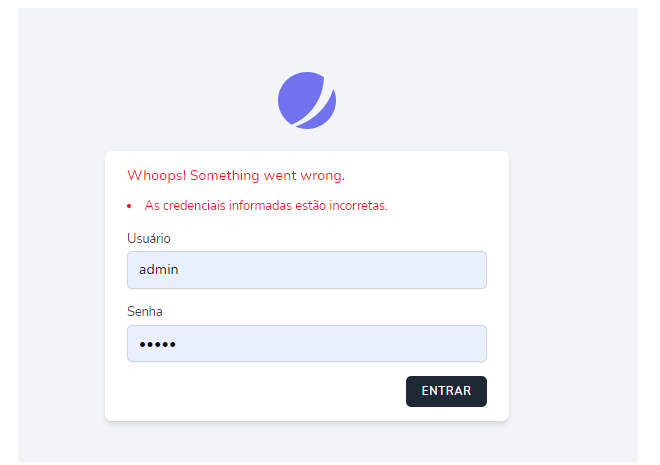

# Tarefas

Este arquivo descreve as tarefas do projeto de controle de vacinas por bairro.

## Backend

### Criar endpoint de login (FEITO ATE O ITEM 4)

1. Criar endpoint de login em `UsuarioController` com a anotação `@PostMapping` para o caminho `/login`.
2. O endpoint deve receber um objeto `LoginDto` como parâmetro.
3. O endpoint deve realizar uma consulta no banco de dados para encontrar um usuário com o login e senha fornecidos.
4. Se o usuário for encontrado, o endpoint deve retornar o usuário para a página inicial. Caso contrário, o endpoint deve redirecionar para a pagina de login.
5. (Opcional) Adicionar mensagem de erro quando nao encontrar usuario, exemplo na Validação de ideias

### Criar endpoint de cadastro de vacinas (FEITO ATE O ITEM 3)

1. Criar endpoint de cadastro de vacinas em `VacinaController` com a anotação `@PostMapping` para o caminho `/`.
2. O endpoint deve receber um objeto `VacinaBairroDto` como parâmetro.
3. O endpoint deve realizar uma inserção no banco de dados contendo o id da vacina, a data de aplicação, e o id do bairro.
4. Após concluída a operação, deve limpar os campos, deixando apenas o bairro selecionado.
5. (Opcional) Mostrar mensagem de registro salvo.

### Criar endpoint de buscar relatório (FEITO ATE O ITEM 2)

1. Criar endpoint de listar por bairro em `RelatorioController` com a anotação `@PostMapping` para o caminho `/buscar`.
2. O endpoint deve receber um objeto `RelatorioDto` com os campos que devem ser buscados as vacinas.
3. Criar metodo que busca os registros a partir dos dados enviados.
4. (Opcional) Caso não tenham nenhuma vacina naquele bairro, ainda deve exibir mensagem informando o usuário.
5. (Opcional) Caso o front envie os dados de dataInicial, dataFinal e doença alvo adicionar esses filtros na busca.

## Validação de ideias

* Mensagens de erro:
    * Pesquisar e implementar uma forma de informarmos o usuário de forma simples que ocorreu algum erro. Por exemplo usuario e senha invalidos
Algo nessa linha

      
* Página de relatório:
    * Validar ideia de a página de relatório ser uma listagem de vacina com filtros.
    * (Opcional) tendo a possibilidade de exportar para PDF os registros filtrados.

## Prototipo

O protótipo de todas as telas está disponível no link abaixo:
https://www.figma.com/file/NWIDXrMATVasYz3ydkrByV/Untitled?type=design&node-id=1%3A4&mode=design&t=YAAYSnzwnRS6fs2K-1

## Observações

* Qualquer dúvida ou dificuldade podem pedir ajuda do pessoal do seu grupo
